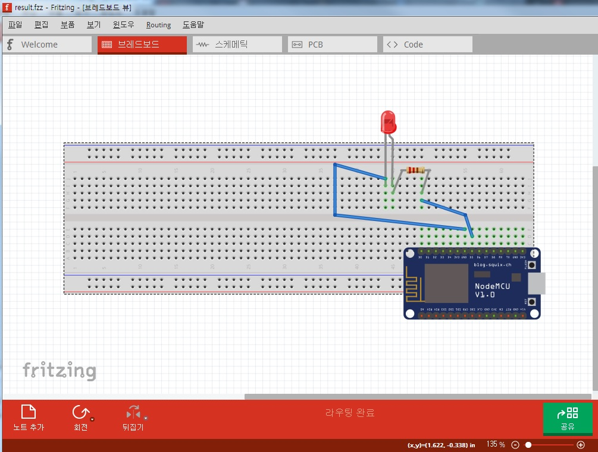

## 펌웨어 구현 (v13.0.0)
 
---

- [학습목차](https://github.com/miniplugin/human)
- 능력단위 요소: LM2001020313__16v4 + LM2001020314__17v5

---

### 학습목표(아래)
- 펌웨어 구현을 통해 펌웨어 설계 문서 분석, 하드웨어 데이터시트 분석, 하드웨어 테스트 SW구현, 부트로더 구현, 소스코드 인스펙션 등을 할 수 있다.

### 핵심키워드(아래)
- 임베디드 하드웨어, 펌웨어, 데이터시트, 하드웨어 테스트 SW, 부트로더, 소스코드 인스펙션

### 펌웨어 설계 문서 분석하기(아래)
- 아두이노의 종류와 특성 3가지: 아두이노 우노, 아두이노 메가, 노드 MCU(실습용 보드-와이파이내장) 
- 프리징 프로그램으로 설계도면을 작성: 프리징 프로그램 free버전 ( https://sourceforge.net/projects/fritzing-portable/ )
- 설계도면 샘플다운로드: https://fritzing.org/projects/ctas_club_20191004_demo01
- 설계도면 결과예시 : 

### 하드웨어 데이터시트 분석하기(아래)
- 구글검색: nodemcu datasheet
- 회로도 확인: http://makeshare.org/bbs/board.php?bo_table=project&wr_id=201
- 위회로도와 매칭되는 실제보드의 포트 확인: D1(보드)-GPIO5, D5(보드)-GPIO14 

### 하드웨어 테스트 SW 구현하기(아래)
- 아두이노 IDE에서 blink예제  프로그램을 실행 및 깜박이는 시간 변경
- 위 설계되면 결과대로 Node MCU 아두이노에서 LED를 1초 단위로 On/Off 시키는 프로그램을 구현
- Delay를 어셈블리로 구현 참조: http://cholla.mmto.org/esp8266/xtensa.html
- 결과예시 : 

### 부트로더 구현하기(아래)
- 플래시 메모리로 전송하는 과정 요약 정리하기
- Node MCU 아두이노에서 웹서버를 띄우고, 웹서버에서 On/Off 시키는 프로그램을 작성
- 결과예시 : 

### 소스코드 인스펙션 하기(아래)
- 위 작업한 소스 3개에 주석을 달면서 인스펙션(검사) 하기.
- 블링크예제 [보기](git_img/01_sketch_led_asm.ino)
- 부트로더와이파이활성화 [보기](git_img/02_sketch_led_wifi.ino)
- 부트로더OnOff서버구현 [보기](git_img/03_sketch_led_server.ino)

### 참고자료 출처(아래)
- 윈7용 UART드라이버 다운로드 [download this](git_img/CP210xVCPInstaller_x64.zip)
- 학습모듈: https://ncs.go.kr/unity/th03/ncsSearchMain.do 20.정보통신 > 01.정보기술 > 02.정보기술개발 > 03.임베디드SW 엔지니어링
- 작업준비:
 
```
   아두이노 본체 와 작업자PC USB 연결
-> 아두이노 IDE Windows 다운로드
-> Driver SW 업데이트 후 포트 확인
-> Arduino IDE 기동 후 환경설정 추가적인 보드 매니저에
     http://arduino.esp8266.com/stable/package_esp8266com_index.json
     추가
-> 메뉴 툴--보드--보드매니저에서 ESP8266 설치 
-> ESP8266 추가 된 예제중 Blinck 선택 한 후 툴--보드--NodeMCU 1.0 선택
-> delay(1000);                     
   digitalWrite(LED_BUILTIN, HIGH); 
   delay(2000);
   초기 on 1초 off 2초 설정을 각각 3초로 변경 
-> 작동 확인    
```
